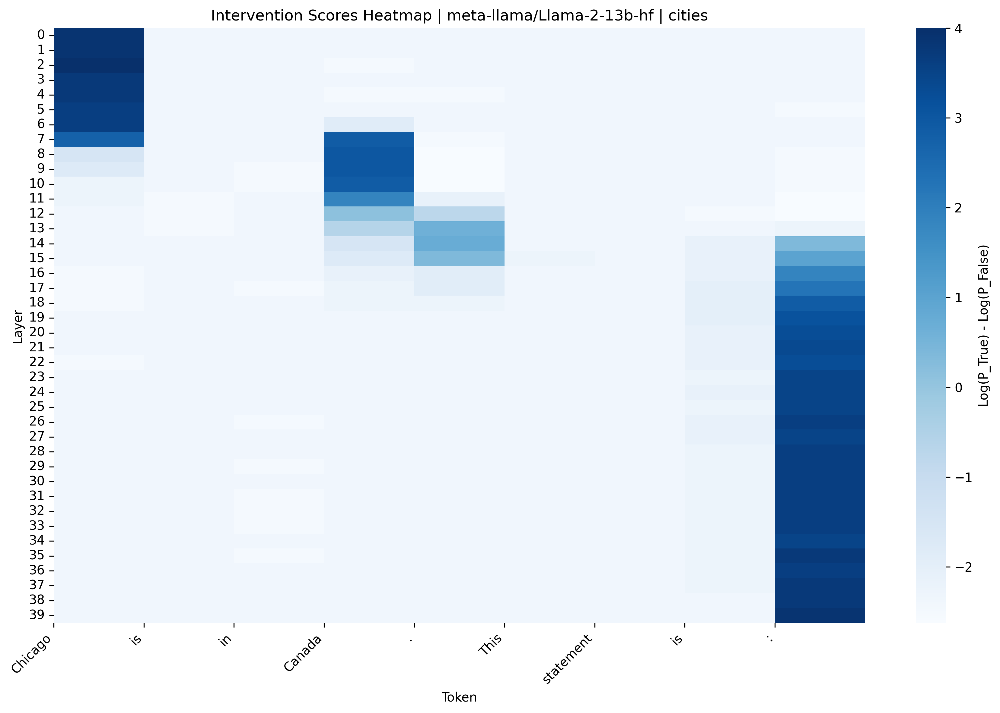
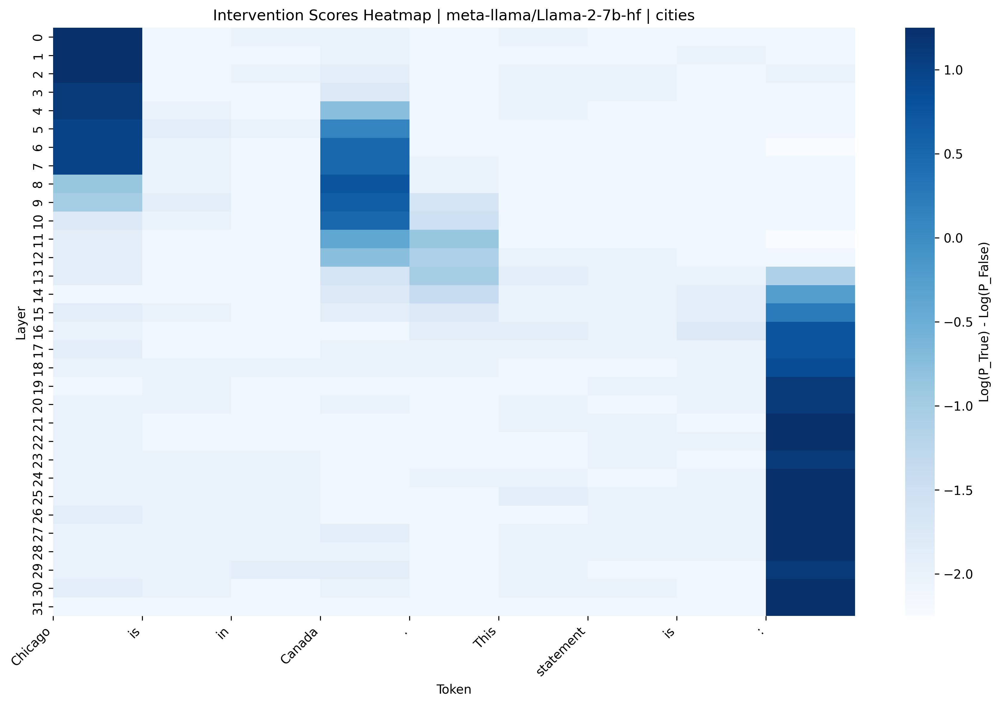
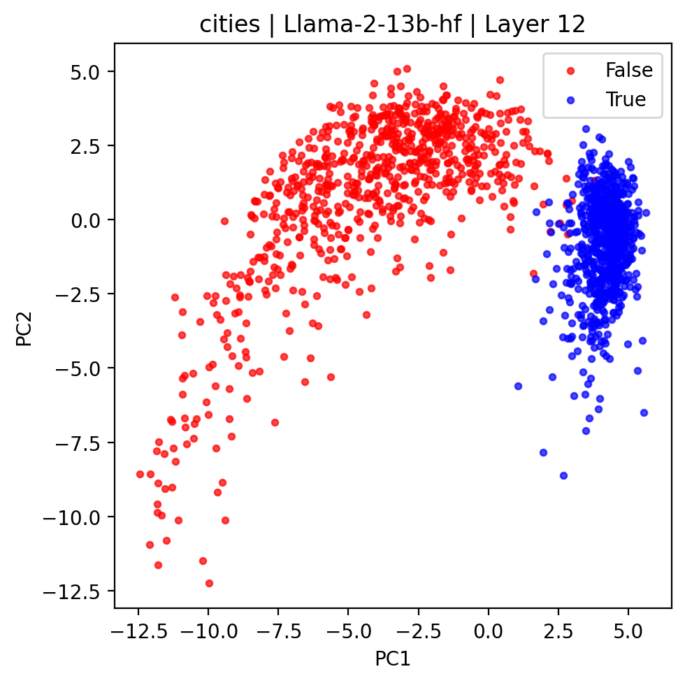
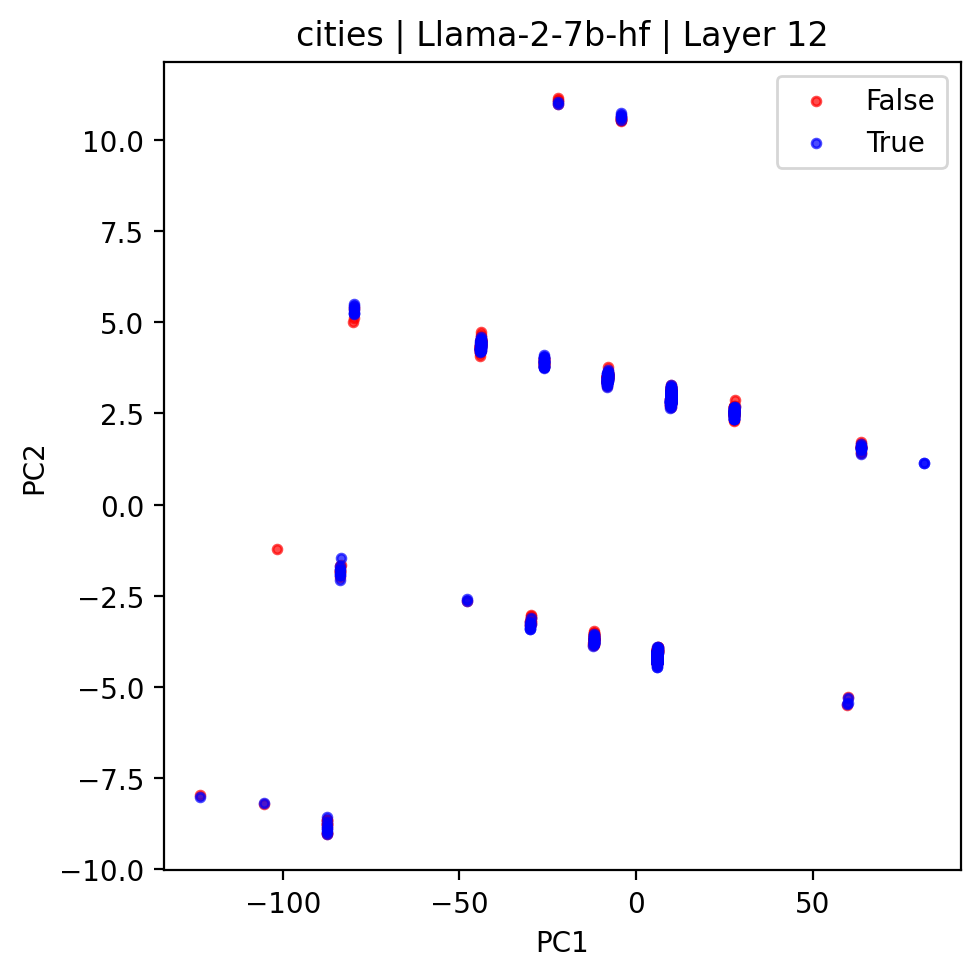

# Geometry of Truth

Reproduction of the paper 
**"Geometry of Truth"**  
[https://arxiv.org/pdf/2310.06824](https://arxiv.org/pdf/2310.06824)

---

## Overview

This project reproduces the experiments (Figures 1 and 2) from *Geometry of Truth*.

The paper localizes activations related to the concept of truth and shows the linear structure of that concept in sufficiently large LLMs via PCA.

---

## Method

Localization
1. Extract residual stream activations from true and false prompts
2. Patch the true activations into false activations by replacing the activations at a layer and token position
3. Compare the difference in $P(TRUE) - P(FALSE)$ before and after patching


PCA
1. Extract residual stream activations from localized token positions
2. Reduce the dimensions into a 2-dimensional subspace using PCA
3. Visualize the results
   
---

## Result

The reproduced results match the findings of the paper:

- Localization

  For Llama-2-13b and Llama-2-7b, the results show a consistent tendency.
  
  <table>
    <tr>
      <td align="center"><strong>Llama-2-13b</strong></td>
      <td align="center"><strong>Llama-2-7b</strong></td>
    </tr>
    <tr>
      <td></td>
      <td></td>
    </tr>
  </table>
  
  
- PCA

  For Llama-2-13b, activations are clearly separated.
  However, the activations of Llama-2-7b are not.
  
  <table>
    <tr>
      <td align="center"><strong>Llama-2-13b</strong></td>
      <td align="center"><strong>Llama-2-7b</strong></td>
    </tr>
    <tr>
      <td></td>
      <td></td>
    </tr>
  </table>

Results for other models are available [here](https://drive.google.com/drive/folders/1Azb5cNOOTnu5KtHXSZw9waYHPEoySMOT?usp=sharing)

---

## Code

The reproductions of localization and PCA are implemented, respectively, in:

```
notebooks/localization.ipynb
notebooks/PCA.ipynb
```

---

## Reproduced models

| Family | Model |
| --- | --- |
| Meta Llama | `meta-llama/Llama-2-7b-hf` |
| Meta Llama | `meta-llama/Llama-2-13b-hf` |
| Meta Llama | `meta-llama/Llama-3.1-8B` |
| Meta Llama | `meta-llama/Llama-3.2-1B` |
| Meta Llama | `meta-llama/Llama-3.2-3B` |
| Pythia | `EleutherAI/pythia-160m` |
| Pythia | `EleutherAI/pythia-410m` |
| Pythia | `EleutherAI/pythia-1b` |
| Pythia | `EleutherAI/pythia-1.4b` |
| Pythia | `EleutherAI/pythia-2.8b` |
| Pythia | `EleutherAI/pythia-6.9b` |
| Qwen | `Qwen/Qwen1.5-1.8B` |
| Gemma | `google/gemma-2b-it` |

---

## Environment

Google Colab (T4/A100 GPU)  
Dependencies are installed in the notebook
Environment last verified: 2026-03-19

---

## Reference

Marks and Tegmark
*Geometry of Truth*  
[https://arxiv.org/pdf/2310.06824](https://arxiv.org/pdf/2310.06824)